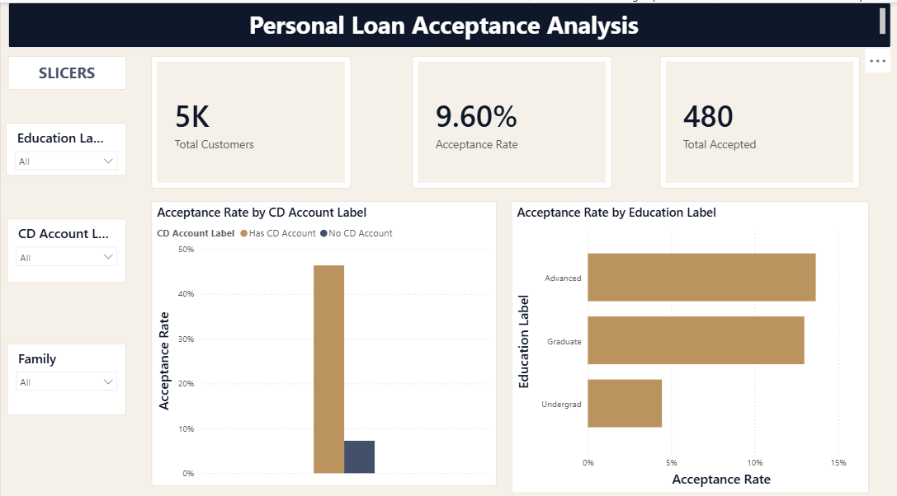
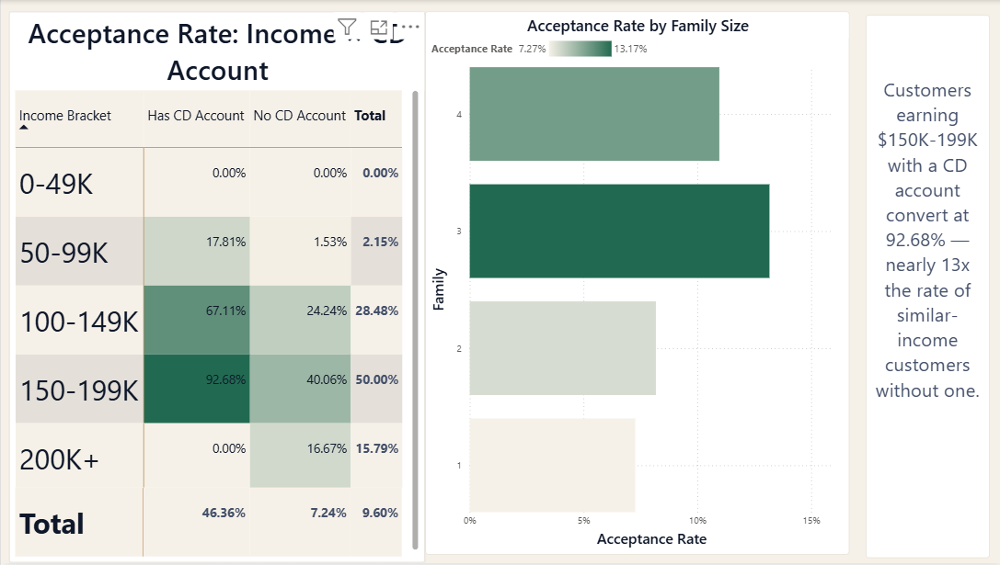

# Thera Bank — Personal Loan Acceptance Analysis

An end-to-end data analysis project exploring which customer segments are most likely to accept a personal loan offer, using **Excel, SQL (PostgreSQL), and Power BI**.

🔗 **Repository:** https://github.com/Merajhusen7/bank-loan-acceptance-analysis

## Business Problem

Thera Bank ran a marketing campaign offering personal loans to its existing liability customers (depositors). Only **480 out of 5,000 customers (9.6%)** accepted the offer. The bank wants to understand which customer characteristics predict loan acceptance, so future campaigns can be targeted more efficiently instead of marketed to the entire customer base.

## Dataset

- **Source:** [Bank Personal Loan Modelling dataset](https://www.kaggle.com/datasets/itsmesunil/bank-loan-modelling) (Kaggle)
- **Size:** 5,000 customer records, 14 attributes
- **Key fields:** Age, Income, Education, Family size, CCAvg (credit card spend), Mortgage, and flags for Personal Loan, CD Account, Securities Account, Online banking, and Credit Card

## Tools & Workflow

| Stage | Tool | What I did |
|---|---|---|
| Data cleaning | Excel | Identified and fixed 52 records with invalid negative `Experience` values |
| Exploration | Excel PivotTables | Built acceptance-rate breakdowns by Education, Income, Family size, CD Account |
| Analysis | PostgreSQL (pgAdmin) | Wrote aggregation queries, `CASE WHEN` bucketing, and a `RANK()` window function |
| Visualization | Power BI | Built an interactive dashboard with KPIs, slicers, and a segment deep-dive |

## Data Cleaning

52 of 5,000 records (1%) had negative `Experience` values — a logical impossibility. Since the values were small (within a few years of zero) and consistent with each customer's Age, I treated this as a sign-entry error and corrected it using `ABS()`, while preserving the original column for transparency.

## Key Insights

1. **CD Account is the strongest single predictor.** Customers with a CD account accept the loan **46.4%** of the time, vs. just **7.2%** without one — a ~6x difference.

2. **Income and CD Account compound, not just add.** Customers earning **$150K–199K with a CD account convert at 92.68%** — nearly **13x** the rate of similar-income customers without a CD account (7.24%), and roughly **100x** the rate of the lowest segment (under $100K income, no CD account, <1%).

3. **Education matters independently.** Undergraduate customers — the largest single group at 42% of the customer base — convert at only **4.44%**, roughly a third of the rate of Graduate (12.97%) and Advanced-degree (13.66%) customers.

4. **Family size has a secondary effect.** 3-person households convert best (**13.17%**), noticeably higher than single- or 2-person households (7–8%).

5. **Small-sample caution.** The $200K+ income bracket contains only 19 customers — its acceptance rate (15.79%) should not be treated as a reliable trend given the limited sample size.

## Dashboard

**Page 1 — Overview:** Total customers, overall acceptance rate, total accepted, with slicers for Education, CD Account, and Family size, alongside acceptance-rate breakdowns by Education and CD Account.

**Page 2 — Segment Analysis:** An Income × CD Account matrix (the project's core finding) with a conditional-formatting heatmap, plus a supporting breakdown by Family size.

## Recommendation

Thera Bank's next campaign should prioritize customers earning **$100K+ who already hold a CD account** — this segment converts at roughly 80%, dramatically outperforming the general customer base. Even outside this top segment, holding a CD account nearly doubles or triples acceptance rates at every income level, suggesting CD account holders are a fundamentally more receptive audience regardless of income.

## Repository Contents

- `bank_loan_analysis.sql` — all SQL queries with comments, plus a summary of insights
- `Bank_Personal_Loan_Modelling.xlsx` — cleaned dataset with Excel PivotTables
- `dashboard.pbix` — Power BI dashboard file
- `ledger_theme.json` — custom Power BI color theme used in the dashboard
- `Page_1.png`, `Page_2.png` — dashboard screenshots

## What I'd Do With More Time

- Build a simple predictive model (logistic regression) to formally rank which features matter most
- Test whether the CD Account effect holds after controlling for Age and Mortgage
- A/B test a targeted campaign against the identified high-propensity segment to validate the recommendation
